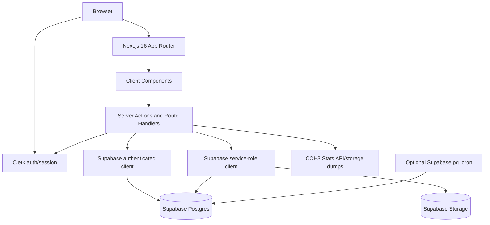
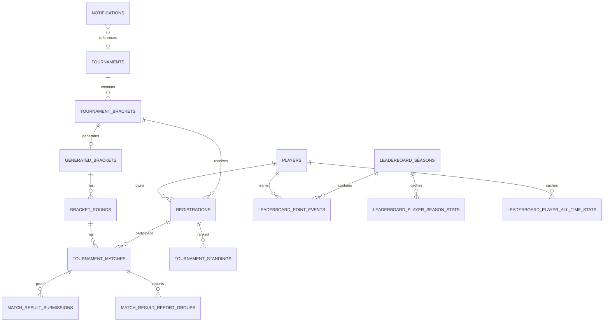

# IronClad Current State Audit

Audit date: 2026-07-19

Scope: this report is based on the repository contents and safe local validation commands only. I did not query the remote Supabase database, Clerk, Vercel, Discord, COH3 Stats, or any production service. Local Supabase migrations are schema definitions in source control, not proof that the remote database has the same state.

Evidence convention: file paths are repository-relative. Line numbers are exact where captured by search output and approximate where the surrounding block is cited.

## 1. Executive summary

IronClad is a Next.js 16 / React 19 application for Company of Heroes 3 community tournaments. The repo currently contains a real player-profile system, Clerk authentication, Supabase-backed tournament definitions, registration review, bracket generation, manual bracket population, match-result reporting with replay proof, no-show reporting, in-platform notifications, and manual leaderboard recalculation.

The implementation is not just a static website, but it is also not a complete production tournament platform. Several critical workflows depend on administrator manual steps: approval, bracket generation, manual player placement, result conflict review, and leaderboard recalculation. There is no real payment system, no email delivery, no subscription system, no webhook-based user provisioning, and no continuous ELO synchronization.

The most important confirmed gap is that the public player directory is designed as public data but is protected by Clerk middleware. `middleware.ts:3-10` does not include `/players(.*)`, while `app/players/page.tsx:12-55`, `lib/public-players.ts:53-109`, and `app/players/[playerId]/avatar/route.ts:34-95` implement public-facing directory and avatar behavior.

The tournament engine supports only admin-created `1v1` tournaments in the current UI and server validation. `lib/tournaments.ts:7` defines `1v1 | 2v2 | 4v4`, and old homepage data includes a 4v4 Battlefy card in `data/currentTournaments.ts:8-48`, but `app/admin/tournaments/actions.ts:32` allows only `["1v1"]`, and `app/admin/tournaments/page.tsx:548-551` offers only a `1v1` select option.

The no-show system is real, not merely copy. It is implemented through `submitNoShowReport()` in `app/tournaments/match-actions.ts:227-360`, UI in `components/PlayerMatchResultForm.tsx:230-272`, and database procedures/columns in `supabase/migrations/20260624100000_match_no_show_reports.sql:3-1010`.

The leaderboard system is database-backed but manual. Public pages read cached/stat tables and views (`lib/leaderboard/public.ts:144-280`), admins trigger recalculation (`lib/leaderboard/admin.ts:68-210`), and migrations define the point ledger (`supabase/migrations/20260624090000_leaderboard_foundation.sql:42-236`). No trigger automatically recalculates points when a tournament completes.

Build validation is currently green. `npm.cmd run lint` passed with one warning in `app/layout.tsx:1` for an unused `Metadata` import. `npm.cmd run build` passed and ran TypeScript successfully, but Next.js emitted a deprecation warning that `middleware.ts` should be replaced by the new `proxy` convention.

## Status Matrix

| System or feature | Status | Evidence | Main files | Database dependencies | Tests or validation | Main limitation |
|---|---|---|---|---|---|---|
| Static marketing pages | Mostly implemented | Home/about/rules render real content, but home still uses Battlefy-era cards | `app/page.tsx`, `app/about/page.tsx`, `app/rules/page.tsx`, `data/currentTournaments.ts` | None for static sections | Build passed | Some copy conflicts with in-app tournament workflow |
| Clerk sign-in/sign-up | Implemented | Prebuilt Clerk pages and global provider | `app/layout.tsx:18-30`, `app/sign-in/[[...sign-in]]/page.tsx`, `app/sign-up/[[...sign-up]]/page.tsx` | Clerk session/JWT integration assumed | Build passed | No repo evidence of Clerk JWT template or admin-role provisioning |
| Player profile editing | Mostly implemented | Authenticated form saves profile and avatar | `app/profile/page.tsx`, `app/profile/actions.ts`, `components/PlayerProfileForm.tsx`, `lib/avatar.ts` | `players`, `player-avatars` | Build passed | No public-profile opt-in UI; no image resizing |
| Public profile opt-in | Partially implemented | DB column/view exists; Discord opt-in UI exists; public-profile toggle absent | `supabase/migrations/20260613128000_public_player_profiles.sql`, `app/dashboard/actions.ts:278-326` | `players.public_profile_enabled`, `public_player_profiles` | Build passed | Profiles default private and user cannot enable public profile from UI |
| Public players directory | Broken | Page/view exist but middleware requires auth | `middleware.ts:3-10`, `app/players/page.tsx`, `lib/public-players.ts` | `public_player_profiles` | Build passed | Logged-out public access is blocked |
| Public avatar proxy | Broken | Route supports public avatars but middleware protects route | `app/players/[playerId]/avatar/route.ts:34-95`, `middleware.ts:3-20` | `players`, `player-avatars` | Build passed | Public avatars cannot be fetched anonymously |
| Admin tournament CRUD | Mostly implemented | Admin-only save/delete/banner upload actions | `app/admin/tournaments/page.tsx`, `app/admin/tournaments/actions.ts` | `tournaments`, `tournament_brackets`, storage buckets | Build passed | 1v1 only; no source-controlled deployment proof |
| Tournament registration | Mostly implemented | Server action validates auth/profile/ELO/capacity and creates registrations | `app/tournaments/actions.ts:63-438`, `components/TournamentsExperience.tsx:2082-2505` | `registrations`, `players`, `platform_settings` | Build passed | App ignores close date; metadata-update failure can leave created row |
| ELO verification | Mostly implemented | Registration-time external check against COH3 Stats | `lib/elo-verification/registration.ts`, `lib/elo-verification/coh3stats.ts`, `app/api/elo-verification/verify/route.ts` | `registrations` ELO columns, `players.coh3_profile_id`, `platform_settings` | Build passed | No rate limiting; no periodic sync; tolerance not configurable |
| Continuous ELO sync | Not implemented | Searches found no cron/job/event for ELO refresh | `lib/elo-verification/*`, `app/api/elo-verification/verify/route.ts` | None beyond registration metadata | Build passed | ELO is checked only at registration/pre-check |
| Bracket generation | Partially implemented | Generates empty structures from approved count | `app/admin/tournaments/actions.ts:324-387`, `supabase/migrations/20260612104000_bracket_safety_and_round_robin_ranks.sql:149-317` | `generated_brackets`, `bracket_rounds`, `tournament_matches` | Build passed | No seeding, no byes, no automatic placement |
| Manual bracket population | Mostly implemented | Admin assignment UI and RPC | `components/AdminBracketPopulation.tsx`, `app/admin/tournaments/actions.ts:389-488`, `supabase/migrations/20260613116000_lifecycle_assignment_lock_and_multi_bracket_ready.sql:83-286` | `tournament_matches`, `tournament_standings` | Build passed | Manual dependency before tournament can start |
| Match result reporting | Mostly implemented | Player series report with one `.rec` per game, opponent confirmation/dispute | `components/PlayerMatchResultForm.tsx`, `app/tournaments/match-actions.ts`, `supabase/migrations/20260613105000_match_result_confirmation_groups.sql` | `match_result_report_groups`, `match_result_submissions`, `match-proofs` | Build passed | Screenshot upload is legacy/display only in current form |
| No-show reporting | Mostly implemented | Real no-show RPC, UI, notifications, leaderboard participation suppression | `app/tournaments/match-actions.ts:227-360`, `supabase/migrations/20260624100000_match_no_show_reports.sql` | `match_result_report_groups`, `leaderboard_point_events` | Build passed | Auto confirmation depends on pg_cron being available/scheduled |
| Leaderboards | Partially implemented | Public views and admin recalculation exist | `app/rankings/page.tsx`, `lib/leaderboard/public.ts`, `lib/leaderboard/admin.ts` | `leaderboard_*` tables/views/functions | Build passed | Recalculation is manual; no automated award on tournament completion |
| In-platform notifications | Mostly implemented | Notification table, center, server events | `lib/notifications.ts`, `lib/notification-events.ts`, `components/InAppNotificationCenter.tsx`, `supabase/migrations/20260613127000_platform_notifications.sql` | `notifications` | Build passed | No email fallback and missing event classes such as tournament start |
| Email notifications | Not implemented | Search found no email provider, templates, or send calls | repo-wide provider search | None | Build passed | Platform notifications only |
| Payments/subscriptions | Not implemented | Search found no provider, checkout, webhook, records, or billing code | repo-wide payment search | None | Build passed | Prize pool is text only |
| Prize display | UI only | Prize pool string saved and displayed | `app/admin/tournaments/page.tsx:594-595`, `lib/tournaments.ts:331-351`, `components/TournamentsExperience.tsx:645-675` | `tournaments.prize_pool` | Build passed | No payout or earnings workflow |
| File uploads | Partially implemented | Avatars, banners, and replays exist with different safety levels | `app/profile/actions.ts`, `app/admin/tournaments/actions.ts`, `app/tournaments/match-actions.ts` | `player-avatars`, `tournament-banners`, `match-proofs` | Build passed | No malware scanning; banner bucket unlimited; no compression |
| Admin dashboard | Mostly implemented | Registration, bracket, ELO, leaderboard, notification, and match controls | `app/admin/page.tsx`, `components/Admin*`, `app/admin/*actions.ts` | Many tournament/leaderboard/notification tables | Build passed | Very large page, limited audit logging, mobile risk |
| Tests | Not implemented | No test script and no test/spec files found | `package.json:6-9`; `rg --files -g "*test*"` returned none | None | Lint/build only | No automated regression/authorization/RLS tests |
| Deployment config | Uncertain | No `.openai/hosting.json`, no explicit deployment descriptor; README is Create Next App boilerplate | `README.md:32-36`, repo root | Host env only | Build passed | Production platform and operational config not declared |
| Internationalisation | Not implemented | English strings and `Intl.DateTimeFormat("en", ...)`; no i18n library/config | app/components search | None | Build passed | Single-language UI |

## 2. Repository and Git state

- Current Git branch: `preview/full-website`.
- Current commit hash: `0abbcd206aaa15edc0cebc040d5a1223a0697511`.
- Latest commit message: `Restyle Tournaments page to match IronClad design`.
- Remote: `origin https://github.com/IronClad2026/ironclad-website.git`.
- Ahead/behind: unavailable because `preview/full-website` has no upstream configured. `git rev-parse --abbrev-ref --symbolic-full-name '@{u}'` failed with `fatal: no upstream configured for branch 'preview/full-website'`.
- Modified files at audit start: none.
- Staged files at audit start: none.
- Untracked files at audit start: none.
- Working tree at audit start: clean.
- Ignored local artifacts present: `.env.local`, `.next`, and `node_modules`.
- Ignored recovery-backup folders: none present in the current filesystem listing. `.gitignore` contains `_recovery_backup/` and `_recovery_backup_*/` patterns.
- Important local uncommitted changes at audit start: none.
- Important local change caused by this audit: this file, `docs/IRONCLAD_CURRENT_STATE_AUDIT.md`, was added because the report is too large for a practical chat response. No source, migration, package, config, or lockfile was changed.

## 3. Technology stack

- Framework: Next.js `16.2.6`, `package.json:19`.
- React: `19.2.4`, `package.json:20-21`.
- TypeScript: `^5`, strict mode in `tsconfig.json`.
- Routing: Next.js App Router under `app/`.
- Authentication: Clerk via `@clerk/nextjs ^7.3.7`, `package.json:12`; `ClerkProvider` in `app/layout.tsx:18-30`.
- Database and storage: Supabase JS `^2.106.1`, `package.json:14`; clients in `lib/supabase*.ts`.
- Styling: Tailwind CSS v4 through `@tailwindcss/postcss` and `app/globals.css`.
- Animation: Framer Motion `^12.38.0`, GSAP `^3.15.0`, `@gsap/react ^2.1.2`, Lenis `^1.3.25`.
- Icons: `lucide-react ^1.16.0`.
- Linting: ESLint 9 with Next config, `eslint.config.mjs`.
- Tests: no test framework or test script in `package.json:6-9`; no test/spec files found.
- Deployment config: no `.openai/hosting.json`, `vercel.json`, Dockerfile, or CI workflow found. README still contains default Vercel deployment boilerplate (`README.md:32-36`).

## 4. Architecture overview

The app is a server-rendered Next.js App Router application with many Server Components for data loading and Client Components for rich UI, modals, form state, browser uploads, and in-page navigation.

`app/layout.tsx:18-30` wraps the app in `ClerkProvider`, `SmoothScrollProvider`, `Navbar`, `GlobalSmoke`, `Footer`, and `SiteMusicPlayer`. `components/SmoothScrollProvider.tsx:50-100` enables Lenis only on desktop-like devices and avoids scroll interception inside dialogs or scrollable elements. `components/GlobalSmoke.tsx` adds a fixed video background hidden under reduced-motion classes. `components/SiteMusicPlayer.tsx` implements a manual audio player.

Supabase access is split:

- `lib/supabase-config.ts:1-33` validates public Supabase env vars and normalizes the URL.
- `lib/supabase.ts:1-8` creates a plain public/publishable client.
- `lib/supabase-browser.ts:1-22` creates a browser client that supplies the Clerk token.
- `lib/supabase-server.ts:1-24` creates a server client that supplies the Clerk token.
- `lib/supabase-admin.ts:1-18` creates a server-only service-role client. Its error text says account deletion requires the service role, but this helper is used much more widely.

Server Actions are used for most mutations: tournament registration (`app/tournaments/actions.ts`), match/no-show/admin match actions (`app/tournaments/match-actions.ts`), profile save/delete (`app/profile/actions.ts`, `app/profile/delete-account-action.ts`), dashboard notification actions (`app/dashboard/actions.ts`), admin registration actions (`app/admin/page.tsx` inline actions), admin tournament actions (`app/admin/tournaments/actions.ts`), ELO setting actions (`app/admin/elo-verification-actions.ts`), leaderboard actions (`app/admin/leaderboard-actions.ts`), and notification actions (`app/notifications/actions.ts`).

Route handlers are limited to ELO pre-check and avatar proxy:

- `app/api/elo-verification/verify/route.ts`.
- `app/players/[playerId]/avatar/route.ts`.

Caching is mostly dynamic rendering plus explicit invalidation. `app/tournaments/page.tsx`, `app/rankings/page.tsx`, `app/dashboard/page.tsx`, `app/players/page.tsx`, `app/players/[playerId]/page.tsx`, and `app/players/[playerId]/avatar/route.ts` use `dynamic = "force-dynamic"`. Mutations call `revalidatePath()` broadly (`app/tournaments/actions.ts:402-403`, `app/tournaments/match-actions.ts:204-205`, `app/admin/tournaments/actions.ts:319-320`, etc.). COH3 Stats fetches use `cache: "no-store"` (`lib/elo-verification/coh3stats.ts:560,602`). Private replay proof links are 30-minute signed URLs (`app/tournaments/page.tsx:771`).

No queue worker, app-level cron, webhook route, or email job exists. A database migration attempts to install and schedule a `pg_cron` job for auto-approving expired match result report groups (`supabase/migrations/20260613105000_match_result_confirmation_groups.sql:838-1008`), but whether that job exists remotely cannot be proven from the repository.

## 5. Route inventory

| URL path | Source file | Access | Purpose | Data source | Important components/actions | Status and issues |
|---|---|---|---|---|---|---|
| `/` | `app/page.tsx` | Public | Home page, Battlefy-era featured tournaments, account/profile callout | `data/currentTournaments.ts`, optional Clerk/Supabase profile in `HomeAccountSection` | `CurrentTournamentCard`, `HomeAccountSection` | Mostly implemented, but live tournament copy still references Battlefy as destination (`app/page.tsx:261-268`) |
| `/about` | `app/about/page.tsx` | Public | Product/community explanation | Static constants | `PageHero` style content | Static and functional; hard-coded Discord link at `app/about/page.tsx:26` |
| `/rules` | `app/rules/page.tsx` | Public | Rules and downloadable PDFs | Static data and `public/documents-rules-ppa` | In-page rules tabs | Static and functional; 2v2/4v4 rule copy is not backed by app tournament support |
| `/rankings` | `app/rankings/page.tsx` | Public | Leaderboard page | Supabase leaderboard views | `LeaderboardExperience`, `getPublicLeaderboardData()` | Partially implemented; empty until manual recalculation and public-profile data |
| `/tournaments` | `app/tournaments/page.tsx` | Public | Tournament listing, details, registration, brackets, match reporting | Supabase service-role queries | `TournamentsExperience`, `submitTournamentRegistration`, match actions | Mostly implemented; service-role page load; mobile selector risk; registration close ignored in app gating |
| `/dashboard` | `app/dashboard/page.tsx` | Authenticated player | Player dashboard, registrations, notifications, career data, Discord visibility | Authenticated and service-role Supabase | `InAppNotificationCenter`, `DiscordContactVisibilityCard`, match confirmation/dispute actions | Mostly implemented for signed-in players |
| `/profile` | `app/profile/page.tsx` | Authenticated player | Edit profile, avatar, account deletion | Authenticated Supabase, service-role storage/delete | `PlayerProfileForm`, `DeleteAccountSection` | Mostly implemented; public-profile opt-in absent |
| `/players` | `app/players/page.tsx` | Intended public, actually authenticated | Public player directory | `public_player_profiles` view through service-role helper | `PublicPlayersDirectory` | Broken for public access because middleware protects `/players` |
| `/players/[playerId]` | `app/players/[playerId]/page.tsx` | Intended public, actually authenticated | Public player profile page | `public_player_profiles` | `PublicPlayerProfileHeader`, `PublicPlayerStats` | Broken for public access; history/stat sections are placeholders |
| `/players/[playerId]/avatar` | `app/players/[playerId]/avatar/route.ts` | Intended public/owner/admin, actually authenticated | Avatar proxy hiding Clerk storage path | `players`, `player-avatars` | Route handler `GET` | Public anonymous avatar access blocked by middleware |
| `/admin` | `app/admin/page.tsx` | Admin-only | Registration review, bulk actions, bracket population, ELO settings, leaderboard controls, admin notifications | Service-role Supabase | Inline admin actions, `AdminBracketManagement`, `AdminLeaderboardControls`, `InAppNotificationCenter` | Mostly implemented; very large page, limited audit trail |
| `/admin/tournaments` | `app/admin/tournaments/page.tsx` | Admin-only | Create/edit/delete tournaments, upload banners, generate structures, retry storage cleanup | Service-role Supabase | `TournamentFormShell`, `TournamentBannerPicker`, `DeleteTournamentControl`, `generateTournamentBracket` | Mostly implemented for 1v1 only |
| `/api/elo-verification/verify` | `app/api/elo-verification/verify/route.ts` | Authenticated API | Pre-registration ELO verification endpoint | Clerk auth, Supabase service-role, COH3 Stats | `POST` | Mostly implemented; no rate limiting |
| `/sign-in/[[...sign-in]]` | `app/sign-in/[[...sign-in]]/page.tsx` | Public | Clerk sign-in | Clerk | `<SignIn />` | Implemented |
| `/sign-up/[[...sign-up]]` | `app/sign-up/[[...sign-up]]/page.tsx` | Public | Clerk sign-up | Clerk | `<SignUp />` | Implemented |

Middleware evidence: `middleware.ts:3-10` marks only `/`, `/sign-in`, `/sign-up`, `/tournaments`, `/rules`, `/rankings`, and `/about` public. Everything else is protected by `auth.protect()` at `middleware.ts:13-16`.

## 6. Authentication and authorisation

Clerk is the authentication provider. `ClerkProvider` wraps the whole app in `app/layout.tsx:18-30`. Sign-in and sign-up use Clerk's prebuilt components in `app/sign-in/[[...sign-in]]/page.tsx:1-7` and `app/sign-up/[[...sign-up]]/page.tsx:1-7`.

User provisioning is not automatic. No Clerk webhook route was found. The `players` row is created or updated when the user submits the profile form in `app/profile/actions.ts:41-233`. `HomeAccountSection` and authenticated pages then load profiles by `clerk_user_id`.

Clerk identities are connected to Supabase records by storing `clerk_user_id` on `players`, `registrations`, notifications, and many audit fields. Authenticated Supabase clients forward the Clerk token (`lib/supabase-server.ts:8-24`, `lib/supabase-browser.ts:8-22`), while many server paths use the service-role client after app-layer permission checks.

Admin detection uses `sessionClaims.metadata.role === "admin"` in both client UI and server code:

- Navbar UI gate: `components/Navbar.tsx:72-74`.
- Admin page check: `app/admin/page.tsx:847-853`.
- Admin tournament actions: `app/admin/tournaments/actions.ts:68-72`, `166-171`, `325-329`, `390-394`, `492-496`, `557-561`.
- ELO setting actions: `app/admin/elo-verification-actions.ts:23-33`, `48-52`.
- Notification admin scope actions: `app/notifications/actions.ts:19-124`.

The repository cannot prove how Clerk admin roles are assigned or whether `metadata.role` is stored in a non-user-editable Clerk metadata namespace. That is a human/operator question.

Server-side permission checks exist for major sensitive actions:

- Profile save requires `auth().userId` and upserts by Clerk ID (`app/profile/actions.ts:41-233`).
- Account deletion requires auth and text confirmation `DELETE` (`app/profile/delete-account-action.ts:14-118`).
- Tournament registration requires auth, profile ownership, profile completeness, bracket eligibility, and optional ELO verification (`app/tournaments/actions.ts:63-438`).
- Match result submission verifies the submitting Clerk user owns one of the match registrations (`app/tournaments/match-actions.ts:91-108`).
- No-show submission verifies the reporter is a participant and cannot report themselves (`app/tournaments/match-actions.ts:253-296`).
- Match confirmation/dispute flows call database RPCs with the Clerk user ID (`app/tournaments/match-actions.ts:363-440`, `app/dashboard/actions.ts:194-274`).
- Admin tournament, registration, ELO, leaderboard, and match-management actions repeat server-side admin checks.

Client-side permission checks are used for visibility and ergonomics only. `TournamentsExperience` receives `viewer.isAdmin` and hides/shows admin controls, but the corresponding server actions also check admin (`components/TournamentsExperience.tsx`, `app/tournaments/match-actions.ts:1006-1015`).

Supabase RLS is defined locally for important tables: players/registrations (`supabase/migrations/20260611080000_base_schema.sql:133-223`), public tournament data (`20260611090000_admin_tournament_creation.sql:195-214`), generated bracket data (`20260611092000_live_tournament_brackets.sql:325-353`), match submissions/report groups (`20260611102000_match_results_and_progression.sql:71-87`, `20260613105000_match_result_confirmation_groups.sql:217-241`), notifications (`20260613127000_platform_notifications.sql:120-176`), leaderboard tables (`20260624090000_leaderboard_foundation.sql:245-356`), and platform settings (`20260627100000_platform_settings_elo_verification.sql:20-39`). These are local migration definitions, not confirmed remote state.

Potential authorization weaknesses:

- Public directory routes are accidentally protected by middleware.
- Service-role clients bypass RLS in public and admin server components. This is acceptable only if every query and view filter is correct.
- Admin role trust depends on Clerk claim provenance that is not documented in the repo.
- No explicit rate limiting exists for registrations, ELO checks, uploads, result submissions, no-shows, or notification actions.

## 7. Database and storage architecture

The local schema is defined by many Supabase migrations under `supabase/migrations/`. There is no generated Supabase TypeScript database type file. Repeated `create or replace function` migrations supersede earlier definitions, which makes historical intent hard to audit but does show evolving safeguards.

Main tables from local migrations:

- `profiles`: legacy Clerk profile table (`20260611080000_base_schema.sql:18-23`).
- `players`: player profile identity, Discord/Steam/CoH3 fields, current ELO, avatar URL, profile completion (`20260611080000_base_schema.sql:25-55`), public/Discord opt-ins (`20260613128000_public_player_profiles.sql:4-12`), and CoH3 profile ownership (`20260629090000_coh3_profile_ownership.sql:3-24`).
- `tournaments`: title, slug, description, banner, registration dates, start/end/grand final, status, format, prize pool, rules URL, Battlefy URL, rule format, result confirmation window (`20260611090000_admin_tournament_creation.sql:7-146`, `20260613102000_tournament_phase_one_settings_waitlist.sql:3-7`).
- `tournament_brackets`: bracket name, ELO rules, max players, unique per tournament (`20260611090000_admin_tournament_creation.sql:148-160`; Academy allowed later in `20260702090000_allow_academy_tournament_brackets.sql:1-6`).
- `registrations`: player snapshot, tournament/bracket links, registration status, ELO status, admin notes, identity/ELO verification metadata (`20260611080000_base_schema.sql:81-111`, `20260611090000_admin_tournament_creation.sql:163-172`, `20260627110000_registration_elo_verification_results.sql:1-430`).
- `generated_brackets`, `bracket_rounds`, `tournament_matches`, `tournament_standings`: generated competition structure and match state (`20260611092000_live_tournament_brackets.sql:3-62`).
- `match_result_submissions`: legacy and per-game proof records with replay/screenshot paths (`20260611102000_match_results_and_progression.sql:17-47`, later altered by game-level/report-group migrations).
- `match_result_report_groups`: active series-level result packages and no-show records (`20260613105000_match_result_confirmation_groups.sql:3-63`, `20260624100000_match_no_show_reports.sql:3-74`).
- `player_notification_dismissals`: dismissal state for dashboard-generated match notifications (`20260612103000_player_notification_dismissals.sql:3-31`).
- `tournament_deletion_jobs`: storage cleanup manifests after tournament deletion (`20260612100000_tournament_deletion_system.sql:3-30`).
- `notifications`: in-platform notification center (`20260613127000_platform_notifications.sql:1-21`).
- `leaderboard_seasons`, `leaderboard_point_events`, `leaderboard_player_season_stats`, `leaderboard_player_all_time_stats`, `leaderboard_season_champions`, `leaderboard_recalculation_runs`: leaderboard ledger, caches, champion archive, and recalculation audit (`20260624090000_leaderboard_foundation.sql:3-236`).
- `platform_settings`: JSON settings, currently ELO verification (`20260627100000_platform_settings_elo_verification.sql:3-49`).

Views:

- `public_player_profiles` exposes only public-safe profile fields for opted-in players (`20260613129000_public_player_profile_avatar_presence.sql:5-39`).
- `leaderboard_current_season`, `leaderboard_public_season_standings`, `leaderboard_public_all_time_standings` support the public leaderboard page (`20260624090000_leaderboard_foundation.sql:359-460`).

Important functions and triggers:

- Tournament save/delete/capacity: `save_tournament`, `get_tournament_bracket_capacity`, `delete_tournament_data`.
- Registration guards: `enforce_tournament_registration_availability`, `enforce_registration_elo_eligibility`, `canonicalize_registration_identity`, `submit_verified_player_registration`.
- Brackets: `generate_tournament_bracket`, `repair_generated_bracket_matches`, `save_bracket_assignments`, lifecycle completion functions.
- Results: `submit_match_series_result_report`, `confirm_match_result_report_group`, `dispute_match_result_report_group`, `admin_finalize_match_result_report_group`, `auto_approve_expired_match_result_groups`, `apply_official_match_result`.
- No-shows: `submit_match_no_show_report`, no-show-aware finalization, `suppress_no_show_participation_event`.
- Leaderboards: `get_or_create_leaderboard_season`, `recalculate_leaderboard_for_tournament`, `recalculate_leaderboard_for_season`, `recalculate_leaderboard_all_time`, `add_leaderboard_admin_adjustment`.

Storage buckets:

- `player-avatars`: public bucket, initially 2 MB (`20260611080000_base_schema.sql:229-247`), later raised to 50 MB (`20260625100000_increase_player_avatar_upload_limit.sql:3-5`). App-level avatar upload limit is 10 MB in `lib/avatar.ts:1-8` and `app/profile/actions.ts:310`.
- `match-proofs`: private bucket, 2 MB initially then 10 MB (`20260611102000_match_results_and_progression.sql:65-69`, `20260612090000_match_proof_audit_and_official_results.sql:3-18`). App-level per-replay limit is 10 MB (`app/tournaments/match-actions.ts:983`).
- `tournament-banners`: public bucket with allowed image MIME types but `file_size_limit = null` (`20260612095000_tournament_banner_storage.sql:3-21`). App-level limit is 100 MB (`app/admin/tournaments/actions.ts:45-51`).

Legacy or duplicated schema:

- Early migrations constrain brackets to `Main` and `Challenge`; Academy is added later.
- Early ELO eligibility uses a 1300 split (`20260611092000_live_tournament_brackets.sql:116-119`), superseded by parser-based rules in `20260612110000_review_integrity_fixes.sql:7-208` and later guards.
- Result reporting evolved from legacy `match_result_submissions` to game-level submissions to report groups. The current player form uses report groups and replay arrays, while admin UI still displays legacy submission data.
- `PROJECT_CONTEXT.md` is stale in places: it claims no route handlers or committed migrations exist (`PROJECT_CONTEXT.md:71-73`, `156-158`), but the current repo contains both.

## 8. Implemented player features

Functional player features:

- Sign in and sign up through Clerk.
- Profile editing with display name, in-game name, Discord username, Steam username, optional CoH3 Stats profile URL, country, region, timezone, current ELO, avatar, and bio (`components/PlayerProfileForm.tsx`, `app/profile/actions.ts:343-419`).
- Avatar upload with MIME and file-signature validation for JPEG/PNG/WEBP (`app/profile/actions.ts:125-196`, `321-338`).
- Account deletion with `DELETE` confirmation, avatar removal, registration anonymization, player row deletion, and Clerk user deletion (`app/profile/delete-account-action.ts:14-118`).
- Dashboard view of profile stats, registration cards, notifications, Discord public contact opt-in, match history, and champion history (`app/dashboard/page.tsx:51-584`).
- Dashboard confirmation/dispute actions for result report groups (`app/dashboard/actions.ts:194-274`).
- Discord public visibility toggle (`components/DiscordContactVisibilityCard.tsx`, `app/dashboard/actions.ts:278-326`).

Partially implemented or display-only player features:

- Public directory search, country filter, and ELO filter are client-side and functional for loaded rows (`components/PublicPlayersDirectory.tsx:25-52`, `96-126`), but the route is not publicly reachable due to middleware.
- Public profile pages show header fields and current ELO/country/region, but tournament history and match statistics are placeholders (`components/PublicPlayerStats.tsx:65-71`).
- Public profile opt-in is database-only. `players.public_profile_enabled` defaults false (`20260613128000_public_player_profiles.sql:4`) and no profile/dashboard action updates it.
- Leaderboard profile cards depend on public profile opt-in and manual leaderboard recalculation.
- Gameplay clips, earnings history, and public match history are absent.

Privacy notes:

- `public_player_profiles` deliberately hides raw avatar URLs because storage paths contain Clerk user IDs (`20260613129000_public_player_profile_avatar_presence.sql:21-35`).
- The avatar proxy uses player ID and downloads from `${clerk_user_id}/avatar` server-side (`app/players/[playerId]/avatar/route.ts:72-74`), but middleware prevents anonymous access.
- Discord is exposed only if `discord_public_enabled` is true (`lib/public-players.ts:105-109`).

## 9. Implemented tournament features

Implemented:

- Admin can create, edit, and delete tournaments with banner, dates, status, format, prize pool text, rules URL, Battlefy URL, enabled brackets, and result confirmation window (`app/admin/tournaments/page.tsx`, `app/admin/tournaments/actions.ts`).
- Public tournament page loads active database tournaments and related bracket/registration/match data (`app/tournaments/page.tsx:25-286`).
- Player registration flow uses saved profile data and agreement checkboxes (`components/TournamentsExperience.tsx:2082-2505`).
- Admin registration review supports approve/reject/manual review/waitlist and bulk approve/delete (`app/admin/page.tsx:372-844`, `1282-1303`).
- Waitlist state and FIFO/capacity protections exist in migrations (`supabase/migrations/20260613126000_waitlist_promotion_open_and_rejected_lock_guards.sql:3-278`).
- Empty bracket structures can be generated from approved-player counts (`app/admin/tournaments/actions.ts:324-387`).
- Admins manually place approved players in generated structures (`components/AdminBracketPopulation.tsx:281-592`).
- Match result reporting, confirmation, dispute, admin review, admin direct result entry, participant edits, and match reset exist (`app/tournaments/match-actions.ts:32-1016`, `components/MatchResultControls.tsx`).

Absent or partial:

- 2v2 and 4v4 are not actually supported in the admin tournament creation path.
- No team roster model exists.
- No automatic seeding exists.
- No byes exist. Non-power-of-two counts produce round robin instead of single elimination with byes.
- No automatic tournament start by date exists. Tournament status moves to `in_progress` after all active generated brackets are populated through the assignment RPC (`20260613116000_lifecycle_assignment_lock_and_multi_bracket_ready.sql:263-270`).
- No automatic leaderboard recalculation on completion exists.
- Tournament start notifications were not found.

## 10. Tournament registration lifecycle

1. Admin creates a tournament: exists through `/admin/tournaments`, `saveTournament()` (`app/admin/tournaments/actions.ts:162-321`) and `save_tournament` RPC. Server admin check exists. Only 1v1 passes validation.

2. Tournament is displayed publicly: exists through `/tournaments`, `app/tournaments/page.tsx:25-286`, and `TournamentsExperience`. Uses service-role reads and public page access.

3. Player opens tournament: exists. Logged-out players can browse `/tournaments` because middleware marks it public.

4. Player registers: exists. Client modal gathers tournament, bracket, agreements, optional CoH3 URL (`components/TournamentsExperience.tsx:2082-2505`). Server action is `submitTournamentRegistration()` (`app/tournaments/actions.ts:63-438`).

5. Eligibility and ELO checked: exists at registration time. Client checks bracket rules (`components/TournamentsExperience.tsx:2103-2189`) and server checks saved ELO against bracket rules (`app/tournaments/actions.ts:265-269`). If ELO verification is enabled, server calls `verifyRegistrationEloIdentity()` (`app/tournaments/actions.ts:273-286`).

6. Registration enters state: exists. New registrations become `pending` or `waitlisted` (`app/tournaments/actions.ts:354-365`). If ELO verification is enabled and metadata saves successfully, `elo_status` becomes `verified` (`app/tournaments/actions.ts:621-644`).

7. Admin reviews/approves: exists. Inline admin actions update registration status (`app/admin/page.tsx:372-535`) and bulk approve (`app/admin/page.tsx:708-844`).

8. Capacity/waitlist rules: partially duplicated. App pre-computes capacity and waitlist (`app/tournaments/actions.ts:150-171`). Database guard enforces open/close window, capacity, FIFO, and roster locks in the latest waitlist migration (`20260613126000_waitlist_promotion_open_and_rejected_lock_guards.sql:90-273`). App UI does not check `registration_close_at`, so users may see a register affordance after close and hit a database failure.

9. Bracket generated/populated: generation exists, population is manual. Empty structure generation uses approved count (`20260612104000_bracket_safety_and_round_robin_ranks.sql:192-227`), then admins assign players (`20260613116000_lifecycle_assignment_lock_and_multi_bracket_ready.sql:156-249`).

10. Matches created: exists during bracket generation. Single elimination creates rounds/matches; round robin creates one match per pair (`20260612104000_bracket_safety_and_round_robin_ranks.sql:226-286`).

11. Players submit results: exists through `submitMatchResult()` and `PlayerMatchResultForm`. Validation requires assigned participants, valid score, and exact replay count (`app/tournaments/match-actions.ts:32-204`).

12. Opponents confirm/dispute: exists through dashboard and tournament controls calling `confirm_match_result_report_group` and `dispute_match_result_report_group` (`app/tournaments/match-actions.ts:363-440`, `app/dashboard/actions.ts:194-274`).

13. Admin reviews evidence/conflicts: exists through `reviewMatchResultReportGroup()` (`app/tournaments/match-actions.ts:443-490`) and UI in `MatchResultControls`/`AdminMatchResultSummaries`.

14. Players advance: exists in database result finalization. `apply_official_match_result` and later finalization functions update winners and next matches; round-robin standings are recalculated by trigger (`20260612104000_bracket_safety_and_round_robin_ranks.sql:380-498`).

15. Tournament completed: exists in DB lifecycle trigger when active brackets complete (`20260613118000_lifecycle_recomputes_after_match_reset.sql:3-156`).

16. Winner/history records: partially exists. Winners are derived from final match or round-robin rank. Player dashboard champion history derives from tournament/match data (`lib/player-dashboard.ts:805-860`). Leaderboard champion archive exists in database (`20260624090000_leaderboard_foundation.sql:197-213`) but depends on recalculation.

17. Leaderboard points: manual. Admin triggers recalculation (`components/AdminLeaderboardControls.tsx`, `lib/leaderboard/admin.ts:68-210`). No automatic award was found.

18. Notifications: partially exists. Registration submission/status, match submission, no-show, confirmation/dispute, and admin review notifications exist (`lib/notifications.ts`, `lib/notification-events.ts`, `app/tournaments/actions.ts:415-438`, `app/tournaments/match-actions.ts:185-198`). Tournament-start notifications were not found. Email notifications do not exist.

## 11. Bracket and match lifecycle

Admin bracket generation:

- `generateTournamentBracket()` checks admin role and calls either `repair_generated_bracket_matches` or `generate_tournament_bracket` (`app/admin/tournaments/actions.ts:324-387`).
- Generation uses approved registration count. If fewer than 2 approved players exist, no structure is generated (`20260612104000_bracket_safety_and_round_robin_ranks.sql:192-201`).
- Power-of-two approved counts produce `single_elimination`; all other counts produce `round_robin` (`20260612104000_bracket_safety_and_round_robin_ranks.sql:205-207`).
- Single-elimination final matches are BO5, all other matches BO3 (`20260612102000_grand_final_series_format.sql:3-47`).
- There is no seeding, automatic assignment, or bye support.

Manual population:

- Admin assignment UI writes a JSON slot assignment (`components/AdminBracketPopulation.tsx:70-91`, `585`).
- Server action validates JSON and calls `save_bracket_assignments` (`app/admin/tournaments/actions.ts:389-488`).
- The latest assignment function requires exactly one assignment per slot, approved registrations from the same bracket, no duplicate slots, and blocks changes after tournament in-progress/completed (`20260613116000_lifecycle_assignment_lock_and_multi_bracket_ready.sql:141-203`).
- When all active brackets are populated, tournament status is set to `in_progress` and registration is disabled (`20260613116000_lifecycle_assignment_lock_and_multi_bracket_ready.sql:263-270`).

Match reporting:

- Current player flow is series-level. Players submit final score, winner, notes, and one `.rec` replay per game played (`components/PlayerMatchResultForm.tsx:75-160`).
- Server validates score against `series_best_of`, requires winner score to equal required wins, rejects ties, and checks winner is a participant (`app/tournaments/match-actions.ts:890-925`).
- Server rejects duplicate replay payloads by SHA-256 hash (`app/tournaments/match-actions.ts:134-139`, `994-1003`).
- Report groups enforce one active report per match (`20260613105000_match_result_confirmation_groups.sql:97-104`).
- Opponent confirmation finalizes the result; disputes move to admin review (`20260613105000_match_result_confirmation_groups.sql:557-680`).
- Expired pending confirmations can be auto-approved by the database function and optional pg_cron schedule (`20260613105000_match_result_confirmation_groups.sql:838-1008`).

No-show:

- Dedicated no-show system is implemented. It does not require replay proof (`components\MatchResultControls.tsx:632`; `supabase/migrations/20260624100000_match_no_show_reports.sql:226-254`).
- No-show report creates a `match_result_report_groups` row with `result_type = 'no_show'`, no-show fields, and a confirmation deadline (`20260624100000_match_no_show_reports.sql:324-510`).
- Confirmed/auto-approved/admin-approved no-shows suppress participation points through `suppress_no_show_participation_event()` (`20260624100000_match_no_show_reports.sql:907-1010`).

Evidence limitations:

- Screenshot proof remains in legacy database/admin display paths (`match_result_submissions.screenshot_storage_path`, `components/MatchResultControls.tsx:840-891`), but the current player form does not upload screenshots.
- Editing/correcting results exists as admin review decisions and resets, but no player-side "edit my submitted report" workflow was found.

## 12. ELO verification

Registration-time ELO verification is implemented. Continuous or periodic ELO synchronization is not implemented.

Profile URL requirements:

- Profile editing accepts an optional CoH3 Stats URL (`components/PlayerProfileForm.tsx:272-276`).
- Tournament registration requires a valid CoH3 Stats URL only when ELO verification is enabled (`app/tournaments/actions.ts:236-243`).
- URL parsing accepts only `http` or `https` URLs on `coh3stats.com` or `www.coh3stats.com` under `/players/{digits}`; numeric input is accepted by `parseCoh3StatsProfileInput()` but `parseCoh3StatsProfileUrl()` rejects bare numeric IDs (`lib/coh3-stats-profile.ts:8-69`).

External retrieval:

- `verifyCoh3StatsElo()` fetches COH3 Stats `playerExport` CSV first (`lib/elo-verification/coh3stats.ts:427-459`).
- It also falls back to COH3 Stats storage leaderboard JSON dumps (`lib/elo-verification/coh3stats.ts:459-545`, `754`).
- This is API/storage retrieval, not browser scraping.
- Fetches use `AbortSignal.timeout(10000)` and `cache: "no-store"` (`lib/elo-verification/coh3stats.ts:91`, `560`, `602`).

Mode and ELO:

- Supported verification modes in the verifier are `1v1`, `2v2`, `3v3`, and `4v4` (`lib/elo-verification/coh3stats.ts:8`, `158-175`).
- Registration passes `tournament.format` as mode (`app/tournaments/actions.ts:277`), but admin creation currently supports only `1v1`.
- COH3 Stats ELO is the highest rounded rating across factions for the checked mode (`lib/elo-verification/coh3stats.ts:123-124`, `202-219`).

Identity and tolerance:

- IGN matching is exact after trimming, lowercasing, and collapsing whitespace (`lib/elo-verification/coh3stats.ts:226-256`).
- ELO discrepancy threshold is 75 (`lib/elo-verification/coh3stats.ts:95`, `217-218`).
- The threshold is hard-coded and not configurable through `platform_settings`.
- Support URL is configurable through `platform_settings` and admin UI (`lib/platform-settings.ts:5-9`, `components/AdminEloVerificationSupportLinkForm.tsx`), but it accepts any HTTP/HTTPS URL and is not restricted to Discord.

Success/failure:

- Success returns `ok: true` from `verifyRegistrationEloIdentity()` (`lib/elo-verification/registration.ts:137-149`).
- Registration then saves the canonical CoH3 URL/profile ID on the player and writes registration verification metadata (`app/tournaments/actions.ts:290-354`, `621-644`).
- Failure returns an actionable reason and message and normally prevents registration (`app/tournaments/actions.ts:273-286`).
- There is a fragile case: `submit_verified_player_registration` can create the registration, then the later metadata update can fail and return "Registration was created, but ELO verification metadata could not be saved" (`app/tournaments/actions.ts:650-659`).

Admin visibility:

- Admin dashboard shows submitted ELO and ELO status in registration detail (`app/admin/page.tsx:1577` and nearby detail rendering), but searches did not find UI display of `elo_verified_elo`, `elo_difference`, `elo_checked_mode`, `elo_checked_at`, or payload fields.
- Dashboard shows player registration `elo_status` and submitted ELO (`app/dashboard/page.tsx:71`, `413-417`).

Disabled mode:

- ELO verification default setting is disabled in code (`lib/platform-settings.ts:32-39`) and migration inserts `{"enabled": false}` (`20260627100000_platform_settings_elo_verification.sql:44-49`).
- Admin UI explicitly says disabled mode allows fake/test ELO profiles (`components/AdminEloVerificationChecker.tsx:51-52`). That is not safe for a production competition if ELO integrity is required.

No synchronization:

- No cron, scheduled function, route handler, page request, admin action, queue, or webhook was found that refreshes player ELO after registration.
- Historical registration ELO values are stored on registration rows (`submitted_elo`, `elo_verified_elo`, `elo_checked_at`), but there is no later synchronization job.
- Tournament eligibility can change for future registrations if a player edits saved ELO, but existing registration state is not automatically rechecked by app code.

## 13. Leaderboard and reward system

The public leaderboard is backed by database views and cached stats:

- `app/rankings/page.tsx:12` calls `getPublicLeaderboardData()`.
- `lib/leaderboard/public.ts:144-280` loads current season, season standings, all-time standings, and season champions.
- Views are defined in `supabase/migrations/20260624090000_leaderboard_foundation.sql:359-460`.

Admin recalculation exists:

- Tournament recalc: `lib/leaderboard/admin.ts:68-122`, requiring a completed tournament.
- Current-season recalc: `lib/leaderboard/admin.ts:124-182`.
- All-time recalc: `lib/leaderboard/admin.ts:184-210`.
- UI: `components/AdminLeaderboardControls.tsx`.

Point-event ledger:

- `leaderboard_point_events` stores events and sources (`20260624090000_leaderboard_foundation.sql:42-77`).
- Stats caches are `leaderboard_player_season_stats` and `leaderboard_player_all_time_stats`.
- Recalculation run history is `leaderboard_recalculation_runs`.

Point values found:

- Participation: 10 points for Academy, Challenge, and Main after the Academy reward migration (`20260702100000_leaderboard_academy_rewards.sql:85`).
- Round passed: Main 5, Academy/Challenge 2 (`20260702100000_leaderboard_academy_rewards.sql:86-87`).
- Tournament win: Main 5, Academy/Challenge 3 (`20260702100000_leaderboard_academy_rewards.sql:88-89`).
- Earlier migrations had Main/Challenge only (`20260624094000_fix_leaderboard_season_error_reporting.sql:694-710`), and Academy was patched in later by dynamic SQL replacement.
- No implemented underdog bonus was found.
- `no_show_penalty` exists as an event type (`20260624090000_leaderboard_foundation.sql:70-72`) but searches found participation suppression rather than a negative penalty event.
- `missing_tournament_bonus` exists as an event type but no active insertion path was found.
- `participation_withheld` is inserted by no-show suppression (`20260624100000_match_no_show_reports.sql:945-1010`).

Idempotency:

- Tournament recalculation deletes prior non-`admin_adjustment` point events for the tournament before re-inserting (`20260624094000_fix_leaderboard_season_error_reporting.sql:681-684`), so repeated system recalculation should not double-award those events.
- Admin adjustments are preserved by deletion filters (`20260624094000_fix_leaderboard_season_error_reporting.sql:653-684`).
- Because recalculation is manual, completing a tournament does not automatically award points. It also cannot award points twice unless admins introduce duplicate manual/admin events or a migration inconsistency exists.

Public visibility:

- Leaderboard public views join to `public_player_profiles`, so players without `public_profile_enabled` may not appear publicly even if they have points (`20260624090000_leaderboard_foundation.sql:378-449`).
- `components/LeaderboardExperience.tsx:226-373` has empty-state copy that correctly says rows appear after recalculation.

## 14. Notifications and email

In-platform notifications are implemented:

- Database table, indexes, RLS, and mutation guard are in `supabase/migrations/20260613127000_platform_notifications.sql:1-176`.
- Creation/loading/mark-read/delete helpers are in `lib/notifications.ts:70-367`.
- Notification event helpers for disputes, no-show responses, review decisions, and legacy review decisions are in `lib/notification-events.ts:39-458`.
- Notification center UI is `components/InAppNotificationCenter.tsx`.

Notification events found:

- Registration submitted to admins (`app/tournaments/actions.ts:415-438`).
- Registration approved/rejected/waitlisted/manual review/promoted to players (`app/admin/page.tsx:310-365`, `521`, `816`).
- Match result submitted to admins (`app/tournaments/match-actions.ts:185-198`).
- No-show reported to opponent (`app/tournaments/match-actions.ts:330-345`).
- Match/no-show dispute to admins and reporter responses (`lib/notification-events.ts:39-122`).
- Admin result review decisions to players (`lib/notification-events.ts:139-186`, `430-458`).
- Admin direct official result notifications to players (`app/tournaments/match-actions.ts:839-882`).

Missing notification events:

- No tournament-start notification implementation was found.
- No bracket-generated/populated notification implementation was found.
- No email fallback or digest exists.

Email:

- Searches for common email providers and mail/send/template terms found no provider integration, no templates, no send calls, and no email queue.
- All working notifications are in-platform database notifications.

## 15. Payments, prizes, and subscriptions

No real payment system exists.

Searches found no Stripe, PayPal, checkout, billing, invoice, subscription, premium feature, refund, webhook, payment table, or transaction status implementation.

Prize support is text-only:

- `tournaments.prize_pool` is added in migrations (`20260611090000_admin_tournament_creation.sql:27`, `41-49`).
- Admin form includes `prizePool` (`app/admin/tournaments/page.tsx:594-595`) with 2,000-character validation (`app/admin/tournaments/actions.ts:828-829`).
- Public tournament UI displays prize text if non-empty (`components/TournamentsExperience.tsx:645-675`, `2352-2387`).

No player earnings history, payout workflow, payout records, currency normalization, tax/payment metadata, checkout, refunds, entry fees, subscriptions, or premium features are implemented.

## 16. Admin functionality

Admin areas:

- `/admin`: registration review, status filters, bulk approve/delete, waitlist display, registration details, bracket management, ELO verification settings, leaderboard controls, admin notifications (`app/admin/page.tsx`).
- `/admin/tournaments`: tournament create/edit/delete, banner upload, generated bracket structure controls, deletion storage cleanup retry (`app/admin/tournaments/page.tsx`, `app/admin/tournaments/actions.ts`).

Server protection:

- Admin pages redirect non-admins to `/` (`app/admin/page.tsx:847-853`, `app/admin/tournaments/page.tsx:147-151`).
- Admin actions repeat role checks.

Actions:

- Update single registration status with notes and regeneration-safety checks (`app/admin/page.tsx:372-535`).
- Bulk delete selected registrations with conflict checks against generated brackets, matches, standings, submissions, and report groups (`app/admin/page.tsx:537-706`).
- Bulk approve registrations with DB capacity/FIFO guards and notifications (`app/admin/page.tsx:708-844`).
- Save tournaments and verify saved values (`app/admin/tournaments/actions.ts:162-321`).
- Generate/repair empty bracket structures (`app/admin/tournaments/actions.ts:324-387`).
- Save bracket assignments (`app/admin/tournaments/actions.ts:389-488`).
- Delete tournaments with `DELETE` confirmation and storage cleanup manifest (`app/admin/tournaments/actions.ts:491-554`, `components/DeleteTournamentControl.tsx:218-251`).
- Retry failed storage cleanup (`app/admin/tournaments/actions.ts:556-604`).
- Toggle ELO verification and support link (`app/admin/elo-verification-actions.ts`).
- Recalculate/delete leaderboard recalculation run records (`app/admin/leaderboard-actions.ts`, `lib/leaderboard/admin.ts`).
- Admin direct match result, participant edit, reset, and review (`app/tournaments/match-actions.ts:443-681`).

Confirmation/destructive controls:

- Tournament deletion requires typing `DELETE` in UI and server action (`components/DeleteTournamentControl.tsx:226-251`, `app/admin/tournaments/actions.ts:491-504`).
- Match reset requires typing `RESET` (`components/MatchResultControls.tsx:474-489`, `app/tournaments/match-actions.ts:645-681`).
- Leaderboard run deletion uses `window.confirm()` (`components/AdminLeaderboardControls.tsx:164-165`).
- Bulk registration deletion appears as a submit button (`app/admin/page.tsx:1282-1303`) with explanatory warning text (`app/admin/page.tsx:1345`), but no typed confirmation or browser confirmation was found for that bulk delete.

Audit records:

- Notifications and leaderboard recalculation runs provide some audit trail.
- Tournament deletion jobs record cleanup manifests.
- There is no general admin action audit table for registration status changes, bracket assignment changes, ELO setting changes, or direct match edits.

Mobile concerns:

- Admin tables use wide layouts and many controls. Registration table and tournament admin are likely usable mainly with horizontal scrolling and are high-risk on small screens.
- `app/admin/page.tsx` is 1,735 lines; `components/TournamentsExperience.tsx` is 3,081 lines; `app/admin/tournaments/actions.ts` is 1,015 lines. These are maintainability and regression risks.

## 17. Mobile, accessibility, and visual design

Responsive behavior:

- Navbar has desktop and mobile menus (`components/Navbar.tsx`).
- Tournament page has a mobile floating menu button (`components/TournamentsExperience.tsx:3039-3041`), but the desktop tournament sidebar is hidden below `lg`, and the mobile menu appears tab-oriented. Tournament switching on mobile is a risk if the selected tournament is not easily exposed.
- Many tables and bracket surfaces are dense and likely require horizontal scrolling on phones.

Accessibility:

- Many controls include `aria-label`, `aria-modal`, roles, and focus-visible styles across components.
- Escape-key close handlers exist for tournament match modals and notification modals (`components/TournamentsExperience.tsx:995-1002`, `1204-1211`; `components/InAppNotificationCenter.tsx:115-122`).
- Reduced-motion support exists for the smoke background (`app/layout.tsx`, `components/GlobalSmoke.tsx`) and smooth scrolling is disabled for reduced motion/coarse pointer devices (`components/SmoothScrollProvider.tsx:50-100`).

Likely difficult pages on smartphones/tablets:

- `/tournaments`: complex tabs, bracket diagrams, modals, and mobile tournament selection risk.
- `/admin`: wide registration tables, bulk controls, details, bracket population, leaderboard controls, and notification center.
- `/admin/tournaments`: large forms, banner upload, deletion controls, generated-structure controls.
- `/rankings`: leaderboard tables may be dense on mobile.
- `/players`: filter controls likely usable, but page is auth-blocked for logged-out users.

Visual implementation:

- Dark IronClad theme with image/video backgrounds and orange accent.
- Tailwind utility styling dominates; no formal design-system package.
- Some mojibake/encoding artifacts were observed in match UI strings, including corrupted middle-dot and dash sequences in `components/MatchResultControls.tsx` output, which should be visually checked.

## 18. Integrations and external dependencies

External services:

- Clerk: authentication, user deletion, user/session claims.
- Supabase: Postgres, RLS, RPCs, storage buckets.
- COH3 Stats: ELO verification through CSV API and storage leaderboard dumps.
- Discord: hard-coded and configurable support/community links. No Discord API/bot integration found.
- Battlefy: public/historical links only. Homepage and archive cards still link out.

Environment variables:

Clerk:

- `NEXT_PUBLIC_CLERK_PUBLISHABLE_KEY`
- `CLERK_SECRET_KEY`
- `NEXT_PUBLIC_CLERK_DOMAIN`

Supabase:

- `NEXT_PUBLIC_SUPABASE_URL`
- `NEXT_PUBLIC_SUPABASE_ANON_KEY`
- `NEXT_PUBLIC_SUPABASE_PUBLISHABLE_KEY`
- `SUPABASE_SERVICE_ROLE_KEY`

Used in source code:

- `NEXT_PUBLIC_SUPABASE_URL`
- `NEXT_PUBLIC_SUPABASE_PUBLISHABLE_KEY`
- `NEXT_PUBLIC_SUPABASE_ANON_KEY`
- `SUPABASE_SERVICE_ROLE_KEY`

Documented in `.env.example` but not directly referenced by application code:

- `NEXT_PUBLIC_CLERK_PUBLISHABLE_KEY`
- `CLERK_SECRET_KEY`
- `NEXT_PUBLIC_CLERK_DOMAIN`

These Clerk variables may still be consumed by Clerk/Next runtime conventions; the repo code does not reference them directly.

Variables present by name in `.env.local`:

- `NEXT_PUBLIC_CLERK_PUBLISHABLE_KEY`
- `CLERK_SECRET_KEY`
- `NEXT_PUBLIC_SUPABASE_URL`
- `NEXT_PUBLIC_SUPABASE_ANON_KEY`
- `NEXT_PUBLIC_SUPABASE_PUBLISHABLE_KEY`
- `NEXT_PUBLIC_CLERK_DOMAIN`
- `SUPABASE_SERVICE_ROLE_KEY`

I did not read or record any secret values.

Unsafe or notable fallback behavior:

- `lib/supabase-config.ts:3-12` falls back from `NEXT_PUBLIC_SUPABASE_PUBLISHABLE_KEY` to `NEXT_PUBLIC_SUPABASE_ANON_KEY`.
- Missing service-role key throws only when the admin helper is used (`lib/supabase-admin.ts:6-18`).
- ELO verification setting defaults to disabled if loading fails (`lib/platform-settings.ts:47-64`), which can silently weaken registration integrity.

## 19. Build, lint, and test results

Commands attempted:

- `npm run lint`: failed before running project code because Windows PowerShell blocked `npm.ps1` execution. Error was `PSSecurityException` about scripts being disabled.
- `npm run build`: failed for the same PowerShell execution-policy reason.
- `npm.cmd run lint`: passed with one warning.
- `npm.cmd run build`: passed, including TypeScript checking.

Important validation output:

- Lint warning: `app/layout.tsx:1:15` - `Metadata` is defined but never used.
- Build warning: Next.js 16 says the `middleware` file convention is deprecated and should use `proxy` instead.
- Build route output confirmed dynamic routes for `/`, `/admin`, `/admin/tournaments`, `/api/elo-verification/verify`, `/dashboard`, `/players`, `/players/[playerId]`, `/players/[playerId]/avatar`, `/profile`, `/rankings`, `/sign-in`, `/sign-up`, and `/tournaments`; static output for `/about`, `/rules`, and `/_not-found`.
- No `typecheck` script exists. `next build` ran TypeScript and passed.
- No automated test script exists. No test/spec files were found.

## 20. Security findings

Critical:

- None confirmed from local source alone. This does not mean the application is secure; remote Clerk/Supabase configuration was not inspected.

High:

- Admin authorization depends on Clerk `sessionClaims.metadata.role` provenance. The repo does not prove the claim is non-user-editable or correctly configured in Clerk. Evidence: admin checks in `app/admin/page.tsx:847-853`, `app/admin/tournaments/actions.ts:68-72`, `components/Navbar.tsx:72-74`.
- Service-role Supabase access is used broadly from server routes/components, including public pages. If query filters or views are wrong, RLS will not protect data. Evidence: `app/tournaments/page.tsx:25`, `lib/public-players.ts:53-85`, `lib/leaderboard/public.ts`, `lib/supabase-admin.ts`.
- No rate limiting was found for ELO verification, registration, uploads, result submissions, no-show reports, or notification mutations. Evidence: no middleware/provider/search result implementing throttling.

Medium:

- Public player directory and avatar proxy are broken by middleware, which is both a feature bug and a privacy/availability configuration mismatch. Evidence: `middleware.ts:3-10`, `app/players/page.tsx`, `app/players/[playerId]/avatar/route.ts`.
- Tournament registration UI ignores `registration_close_at`; the DB guard may block inserts, but user-facing state can be wrong. Evidence: `components/TournamentsExperience.tsx:3052-3061`, `app/tournaments/actions.ts:100-133`; DB close guard in `20260613126000_waitlist_promotion_open_and_rejected_lock_guards.sql:90-102`.
- ELO verification can create a registration before failing metadata update, causing an inconsistent state and confusing user error. Evidence: `app/tournaments/actions.ts:587-659`.
- Tournament banner bucket has no bucket-level file-size limit and allows public files; app enforces 100 MB and image signatures, but storage is public and large. Evidence: `20260612095000_tournament_banner_storage.sql:3-21`, `app/admin/tournaments/actions.ts:45-51`, `914-1000`.
- Replay proof upload validates `.rec` extension and size/hash but not MIME signature or malware. Evidence: `app/tournaments/match-actions.ts:982-988`.
- Server Action body limit is 22 MB (`next.config.ts:5-6`), but BO5 can require up to 3-5 replay files at 10 MB each. Large valid submissions can fail at transport/platform level.
- Account deletion is non-transactional across Supabase and Clerk; failure after Supabase cleanup can leave a Clerk account without app data. Evidence: `app/profile/delete-account-action.ts:50-118`.

Low:

- `lib/supabase-admin.ts:11` has misleading error text referencing account deletion even though the service-role helper is used broadly.
- No generated Supabase TypeScript types increase query/schema drift risk.
- Bulk registration deletion lacks typed confirmation or `window.confirm`.
- Stale docs can mislead future implementers (`PROJECT_CONTEXT.md:71-73`, `156-158`).

Informational:

- `globals.css` hides Clerk danger UI, while a custom deletion flow exists.
- Public avatars are proxied to avoid exposing Clerk user IDs, but raw storage remains a public bucket by migration definition.
- Console logging is common for operational errors, but there is no structured logging/monitoring setup.

## 21. Fully implemented features

Fully implemented or apparently functional from local code/build:

- Clerk sign-in/sign-up pages.
- Static About and Rules pages with rulebook/PPA downloads.
- Player profile save with validation and avatar upload.
- Account deletion workflow with explicit confirmation.
- Admin tournament save/delete with server admin checks.
- In-platform notification table and center.
- Registration review status changes with player/admin notifications.
- No-show reporting path with DB-backed state.
- Production build and TypeScript compile through `next build`.

## 22. Partially implemented features

- Tournament registration: real, but close-window mismatch and ELO metadata fragility remain.
- Bracket system: real empty structures and manual population, but no automatic seeding/byes.
- Match reporting: real replay-based series reporting, but screenshot upload is legacy/display-only in current UI.
- Leaderboards: real cached stats and recalculation functions, but manual and without automatic completion hooks.
- Public player profiles: view and UI exist, but opt-in UI and public route access are incomplete.
- Admin dashboard: broad functionality exists, but audit logs, pagination, and mobile ergonomics are limited.
- Storage cleanup: tournament deletion manifest/retry exists, but cross-service cleanup cannot be transactional.

## 23. Interface-only, mocked, or placeholder features

- Prize/payment concepts: prize pool is text only; no payment/payout system.
- Public profile tournament history and match statistics are placeholder cards (`components/PublicPlayerStats.tsx:65-71`).
- Leaderboard empty states say data will appear after recalculation (`components/LeaderboardExperience.tsx:226-373`).
- Homepage current tournament cards are hard-coded Battlefy-era data (`data/currentTournaments.ts:20-48`, `app/page.tsx:274-275`).
- `components\AdminEloVerificationChecker.tsx:52` explicitly describes disabled ELO verification as allowing fake/test ELO profiles.
- Admin bracket assignment uses `TBD / Empty Slot` placeholders before population (`components/AdminBracketPopulation.tsx:517`).

## 24. Missing planned features

- 2v2 and 4v4 tournament creation and team roster support.
- Real payment provider, checkout, entry fees, refunds, payouts, subscriptions, premium features.
- Email notifications and email templates.
- Clerk webhook user provisioning or synchronization.
- Continuous/periodic ELO refresh.
- Automatic tournament start by schedule.
- Automatic bracket seeding and byes.
- Player-side editing/correction of submitted result packages.
- Public-safe match/tournament history loader for player profiles.
- Gameplay clips.
- CI pipeline and deployment runbook.
- Generated Supabase database types.
- Automated unit/integration/e2e/RLS/authorization tests.
- General admin audit log.

## 25. Conflicting rules, labels, thresholds, or business logic

ELO bracket definitions:

- Current tournament/admin/rules/about definitions:
  - Academy: `Below 1100 ELO` (`lib/tournaments.ts:20-23`, `app/admin/tournaments/page.tsx:100`, `app/about/page.tsx:35-36`, `app/rules/page.tsx:115`).
  - Challenge: `1100-1399 ELO` (`lib/tournaments.ts:27-30`, `app/admin/tournaments/page.tsx:106`, `app/about/page.tsx:40-41`, `app/rules/page.tsx:116`).
  - Main / Elite label for `Main`: `1400+ ELO` (`lib/tournaments.ts:34-37`, `app/about/page.tsx:45-46`, `components/LeaderboardExperience.tsx:49-51`).
- Old DB logic uses a 1300 split between Main and Challenge (`supabase/migrations/20260611092000_live_tournament_brackets.sql:116-119`, `196-197`). Later migrations supersede this with rule parsing.
- Profile/directory ELO range options are generic and overlap/differ from tournament brackets: `900-1100`, `1100-1300`, `1300-1500` (`lib/elo-options.ts:8-12`).
- There is no separate Elite bracket in the database or app; "Main / Elite" is a display label.

Registration open/close:

- Client and server action check status and opening date but not closing date (`components/TournamentsExperience.tsx:3052-3061`, `app/tournaments/actions.ts:100-133`).
- Latest DB guard checks closing date (`20260613126000_waitlist_promotion_open_and_rejected_lock_guards.sql:90-102`).

Formats:

- Type definitions and database constraints mention `2v2` and `4v4` (`lib/tournaments.ts:7`, `20260611090000_admin_tournament_creation.sql:97-98`).
- Admin creation rejects anything but `1v1` (`app/admin/tournaments/actions.ts:32`, `816-817`).
- Rules page includes 4v4 rules (`app/rules/page.tsx:178`), and homepage hard-coded data includes a 4v4 Battlefy card (`data/currentTournaments.ts:46-48`).

Leaderboard:

- Base leaderboard migrations are Main/Challenge only. Academy support is added later through dynamic SQL string replacement (`20260702100000_leaderboard_academy_rewards.sql:94-201`), which is fragile and should be verified against the remote function definition.

Documentation:

- `PROJECT_CONTEXT.md` says there are no route handlers, API routes, or committed migrations, which is false for the current repo (`PROJECT_CONTEXT.md:71-73`, `156-158`).

## 26. Known technical limitations

- No remote database verification was performed.
- No generated Supabase types.
- No automated tests.
- No rate limiting.
- No CI/deployment config.
- No production observability or structured logging.
- Service-role usage means data exposure depends heavily on app query filters.
- Leaderboards require manual admin recalculation.
- Public directory is not public due to middleware.
- ELO verification depends on external COH3 Stats availability and exact IGN matching.
- Uploads do not include malware scanning or image resizing.
- Tournament and admin components are very large and hard to reason about.

## 27. Technical debt

- Very large components/actions: `components/TournamentsExperience.tsx` has 3,081 lines; `app/admin/page.tsx` has 1,735; `app/admin/tournaments/actions.ts` has 1,015; `lib/elo-verification/coh3stats.ts` has 1,084.
- Multiple superseded migrations redefine core functions, making the final schema harder to understand.
- Legacy result-submission schema and current report-group schema coexist.
- Hard-coded Discord URLs appear in `app/page.tsx:16`, `app/about/page.tsx:26`, and `lib/platform-settings.ts:8-9`.
- Hard-coded Battlefy-era tournament data remains on the homepage.
- Repeated status strings across UI, actions, and SQL.
- Public-route contract and middleware are out of sync.
- Documentation drift in `PROJECT_CONTEXT.md`.
- No test coverage for authorization, tournament lifecycle, ELO edge cases, or leaderboard idempotency.

## 28. Highest-risk areas

1. Admin authorization claim provenance and broad service-role use.
2. Tournament registration and waitlist consistency across app checks and DB triggers.
3. Match result finalization and no-show auto-approval, especially if pg_cron is not actually enabled remotely.
4. Leaderboard recalculation correctness and Academy dynamic migration patching.
5. Public profile privacy/access mismatch.
6. File upload abuse and large replay/banner payload handling.
7. Lack of automated regression tests around tournament lifecycle.

## 29. Recommended next technical milestones in priority order

1. Confirm Clerk admin-role storage and Supabase JWT template in the actual environments.
2. Fix the public route contract for `/players` and avatar proxy, or intentionally mark the directory authenticated-only.
3. Add integration tests for registration, admin approval, waitlist, bracket population, match reporting, no-show, and leaderboard recalculation.
4. Align app registration availability checks with DB close-window rules.
5. Add rate limiting to registration, ELO verification, no-show, result submission, and upload authorization.
6. Expose full ELO verification metadata to admins or document why it remains DB-only.
7. Add a public-profile opt-in UI if public profiles are intended.
8. Replace `middleware.ts` with the Next.js 16 `proxy` convention after reading the bundled Next docs.
9. Generate Supabase TypeScript types and use them in data-access code.
10. Decide whether leaderboard recalculation should be automatic on tournament completion or explicitly admin-gated.
11. Add upload hardening: smaller banner limits, image resizing, stronger replay handling, and malware/process policy.
12. Split the largest components/actions along existing boundaries after tests exist.

## 30. Questions that cannot be answered from the repository

- Are all local Supabase migrations applied to the remote database?
- Is `pg_cron` enabled and is `auto_approve_expired_match_result_groups` actually scheduled remotely?
- How are Clerk admin roles assigned, and are they in private metadata or another non-user-editable claim?
- What Clerk JWT template is configured for Supabase RLS?
- What is the production hosting platform and deployment process?
- Are storage buckets configured exactly as migrations define them?
- Are real tournament administrators using Battlefy in parallel, or is the internal tournament engine intended to replace it now?
- Should public profiles default private forever, or should players be able to opt in from the UI?
- Should leaderboard recalculation be manual for audit control or automatic for launch?
- What is the intended policy for accepting large replay/banner files and scanning uploads?

## Information Another AI Should Use to Cross-Check Previous Recommendations

Ten most important confirmed facts:

1. The current branch is `preview/full-website` at commit `0abbcd206aaa15edc0cebc040d5a1223a0697511`.
2. The working tree was clean at audit start; only this audit document was added afterward.
3. The app builds successfully with Next.js `16.2.6` and React `19.2.4`.
4. Authentication is Clerk; database/storage is Supabase.
5. Admin role checks use `sessionClaims.metadata.role === "admin"`.
6. Admin-created tournaments are currently `1v1` only.
7. Tournament brackets are generated empty and populated manually.
8. ELO verification exists only at registration/pre-check time; there is no continuous sync.
9. No-show reporting is implemented in UI, actions, and migrations.
10. Payments, subscriptions, real prize payouts, and email delivery are not implemented.

Ten largest gaps between apparent roadmap and actual implementation:

1. Public player directory exists but is not public due to middleware.
2. Public-profile opt-in exists in DB but not in UI.
3. 2v2/4v4 are referenced in types, rules, and old content but not supported for admin-created tournaments.
4. Battlefy-era homepage content remains hard-coded.
5. Leaderboard scoring exists but runs only through manual recalculation.
6. ELO verification can be disabled and defaults disabled if settings fail to load.
7. Screenshot proof is schema/admin-display legacy, not a current player upload flow.
8. Payment/prize/earning concepts are text-only or absent.
9. Documentation says some things are missing that now exist.
10. There are no automated tests despite complex tournament state transitions.

Five most urgent risks:

1. Verify Clerk admin role security before any real admin launch.
2. Align public-route/privacy behavior for players and avatars.
3. Add rate limits and upload hardening before public registration/result submission.
4. Test registration/waitlist/bracket/result/no-show/leaderboard lifecycle end to end.
5. Confirm remote DB migrations, RLS, storage policies, and pg_cron state.

Recommended launch-critical scope:

- 1v1 tournaments only.
- Academy, Challenge, and Main brackets only.
- Manual admin approval and manual bracket population.
- Replay-only match proof with opponent confirmation/dispute.
- No-show reporting if pg_cron status is confirmed or admin review fallback is accepted.
- Manual leaderboard recalculation after completed tournaments.
- In-platform notifications only.

Features that should be postponed:

- Payments, subscriptions, entry fees, refunds, and prize payouts.
- 2v2/4v4/team rosters.
- Gameplay clips.
- Public match history and earnings pages.
- Automatic seeding/byes unless bracket rules are redesigned.
- Email notifications until provider, templates, and deliverability are designed.

Important uncertainties requiring a human answer:

- Which environment is production and how is it deployed?
- Are local migrations applied remotely?
- What exact Clerk metadata/JWT setup is in use?
- Should ELO verification be mandatory in production?
- Should public profiles and player directory be visible to anonymous visitors?
- Should leaderboard recalculation be a manual admin action or automatic on tournament completion?
